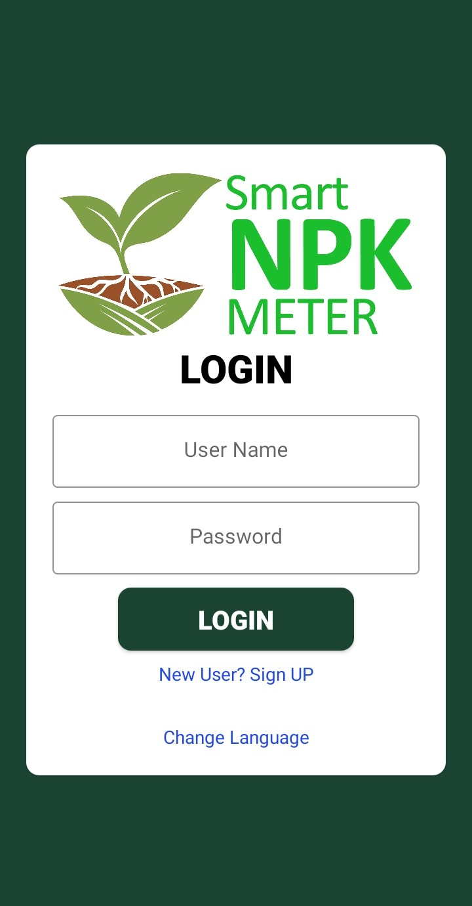
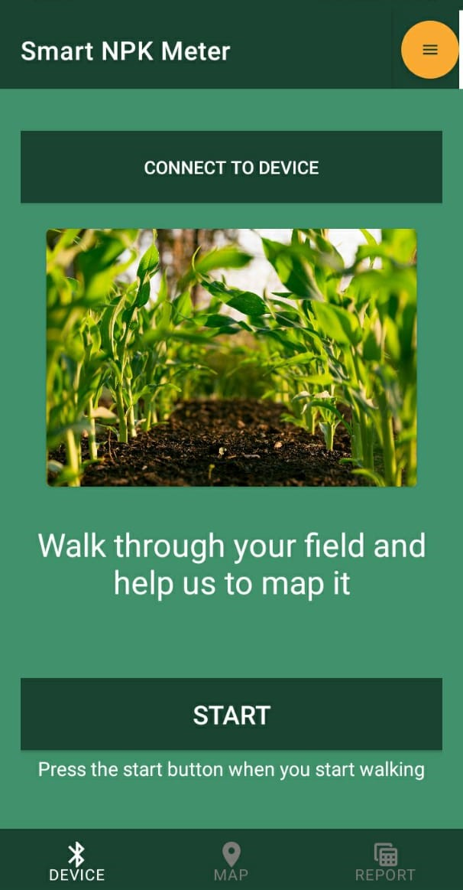
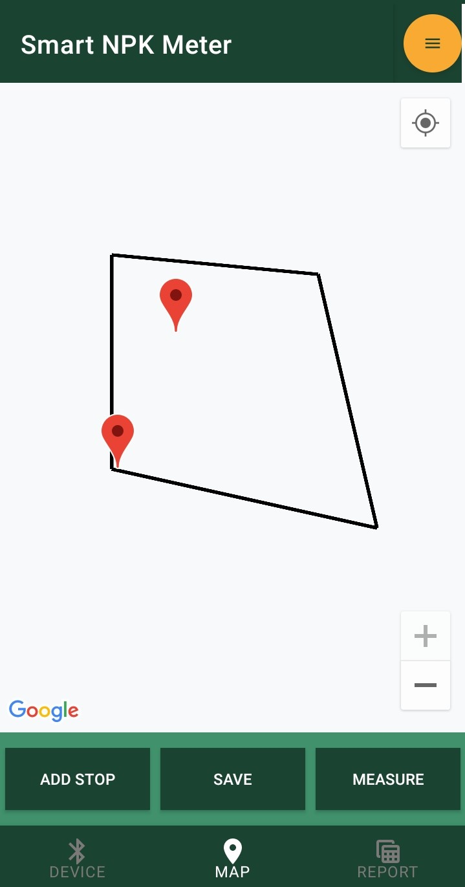
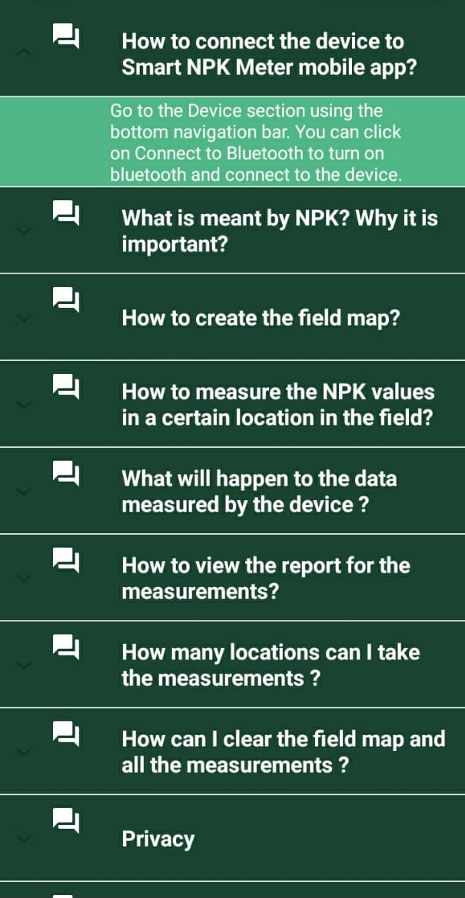
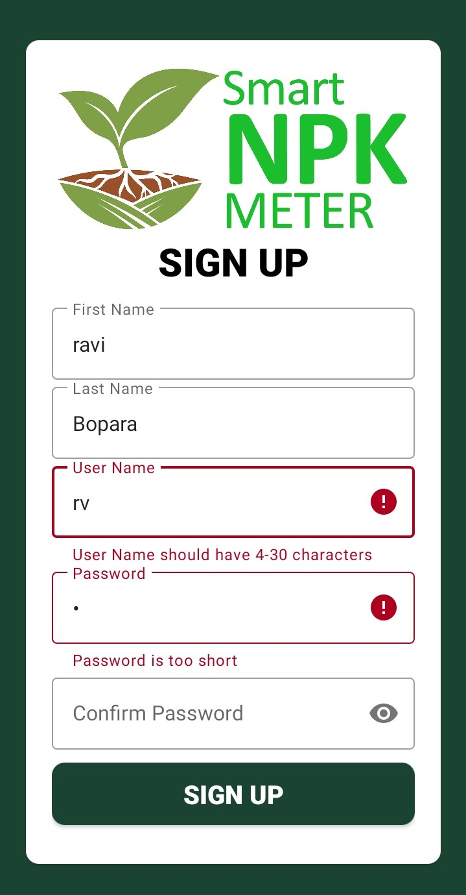
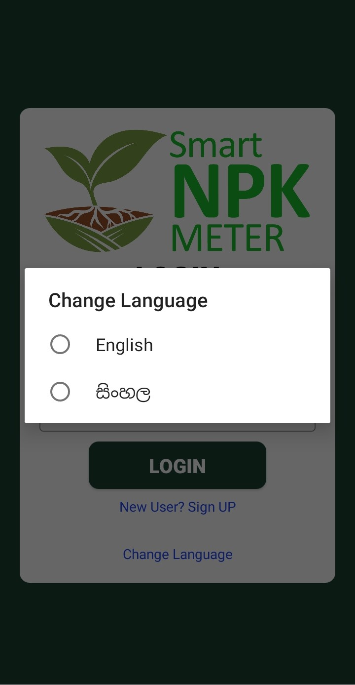

<html>
<head>
<h1>Smart NPK Meter</h1>
</head>
<body>
  <h2>What is this repository for?</h2>
<ul>
  <li>This repository is for Smart NPK Meter android application.</li>
  <li>System Requirements: - Java 8, Android Studio</li>
  <li>Version 1.0</li>
</ul>

  

 
<h2>How do I get set up?</h2>
<ul>
  <li>Clone or Download the repository</li>
  <li>open the project using android studio</li>
  <li>Build and Run the project</li>
</ul> 
  <table style="width:100%">
  <tr>
    <th></th>
    <th></th> 
    <th></th>
    <th></th>
   </tr>
     <tr>
    <th></th>
    <th></th> 
    <th></th>
    <th></th>
   </tr>
     <tr>
    <th></th>
    <th></th> 
    <th></th>
    <th></th>
   </tr>
</table>
<h2>Features</h2>

Smart NPK Meter has an easy to use interface which can communicate with the farmer in few steps. It shows a map of the area and the measuring position so the farmers get to apply fertilizer to those exact places at a later date. Farmer can create the field map by walking around the land.He/she can select the measurement locations and the device will measure the Nitrogen, Phosphorus, and Potassium concentrations of the soil on the land. The mobile app will monitor the measurement results via a Report. After taking the measurements, the mobile app recommends the locations where the NPK concentration is not enough and suggests how much NPK is needed. Due to different versions of the maps, It makes the life of a farmer easier to find the different N, P, or K measurements once at a time. It also has Sinhala and English language support.

App includes all the cool features such as:
  
<ul>
  <li>Create Field Map</li>
  <li>Measure NPK readings</li>
  <li>View Report</li>
  <li>View Recommendations based on measurements</li>
  <li>Collects data remotely</li>
  <li>Cloud database</li>
</ul>

Instructions also are there.

<ul>
    <li>How to connect the device to Smart NPK Meter mobile app?</li>
    <li>What is meant by NPK? Why it is important?</li>
    <li>How to create the field map?</li>
    <li>How to measure the NPK values in a certain location in the field?</li>
    <li>What will happen to the data measured by the device ?</li>
    <li>How to view the report for the measurements?</li>
    <li>How many locations can I take the measurements ?</li>
    <li>How can I clear the field map and all the measurements ?</li>
    <li>Privacy</li>
    <li>Do you like Our App?</li>
    <li>What can I do if I see something unusual happening in the App?</li>
</ul>

finally We have included the privacy policy of the application.

<h2>Sinhala Language Support</h2>
  
This is one of the coolest features in Smart NPK Meter mobile app.Since most of the Sri lankan Farmers are not familiar with English language we added the Sinhala language support.
  
  <table style="width:100%">
  <tr>
    <th></th>
    <th></th> 
    <th></th>
    <th></th>
    </tr>
</table>
<h2>Tested Devices</h2>
<ul>
  <li>Samsung Galaxy M10 [os-Q]</li>
  <li>Oppo A5 2020 [os-Oreo]</li>
  <li>Huawei GR5 mini [os-Nougat]</li>

[comment]: <> (  
Apk file was added - <a href="https://github.com/Team-nanocode/Quiz-me/tree/main/apk">view APK</a> 
)
</ul>
<h2>How to Contribute</h2>
<ul>
  <li>Please report issues at <a href="https://github.com/Nuwan-Harshakumara-Piyarathna/Soil-Content-Analyzer/issues">GitHub Issue Tracker</a>.</li>
  <li>Send your contributions as pull requests to <a href="https://github.com/Nuwan-Harshakumara-Piyarathna/Soil-Content-Analyzer/tree/main">main branch</a>.</li>
</ul>
<h2>Licence</h2>
<ul>
  <li>This project is maintained under the Apache-2.0 licence.</li>
</ul>
</body>
</html>
